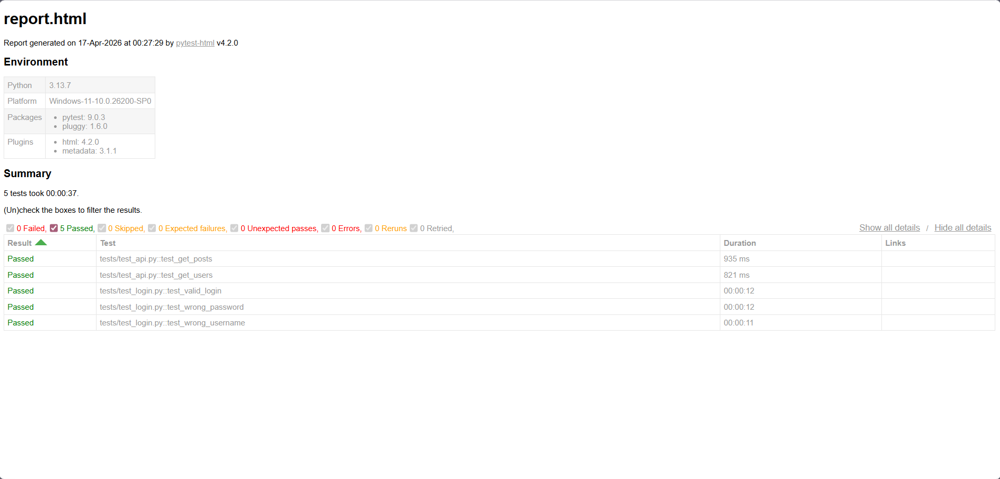
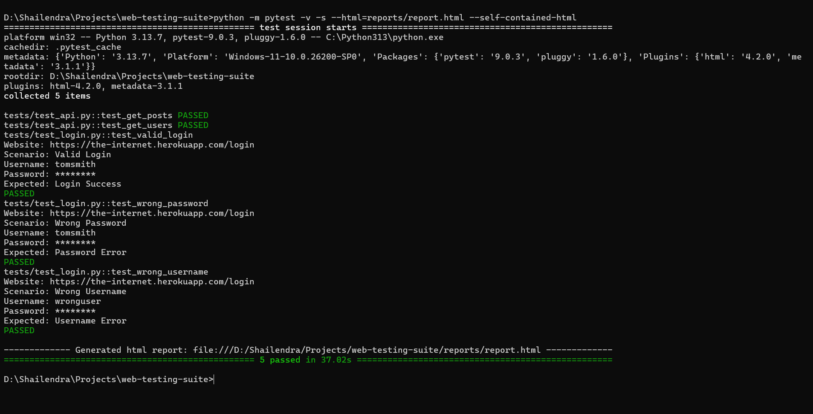

# Web Application Testing & API Validation Suite

A professional QA automation project developed using **Python, Selenium, Pytest, Requests, and Pytest-HTML** to perform automated **UI Testing** and **API Validation** with detailed execution reports.

This project demonstrates practical knowledge of **Software Quality Assurance**, **Automation Testing**, **Functional Testing**, **API Testing**, and **Structured Reporting**.

---

## Project Overview

This suite automates testing of a web application's login functionality and validates backend API responses.

It covers:

- Positive Login Testing
- Negative Login Testing
- Functional Validation
- API Response Testing
- Pass / Fail Reporting
- Failure Screenshot Capture
- HTML Test Execution Reports

---

## Project Preview

### HTML Test Report



### Terminal Execution Output



---

## Features

### Web UI Testing

Automated testing of login page scenarios:

- Valid Login
- Invalid Username
- Wrong Password
- Functional Authentication Checks

### API Testing

Automated validation of public APIs:

- GET Request Testing
- Response Code Validation
- JSON Response Verification
- Data Availability Checks

### Reporting & Evidence

- Professional HTML Test Reports
- Scenario-wise Execution Logs
- Pass / Fail Status
- Failure Screenshots
- Execution Summary

---

## Tech Stack

- Python 3.x
- Selenium WebDriver
- Pytest
- Requests
- Pytest HTML
- WebDriver Manager
- Google Chrome

---

## Project Structure

```text
web-testing-suite/
│── tests/
│   ├── test_login.py
│   └── test_api.py
│── reports/
│── screenshots/
│── assets/
│── requirements.txt
│── README.md
│── .gitignore

## Installation & Setup

Follow these steps to set up the project environment:

1. **Clone the Repository**
   ```bash
   git clone <your-github-repo-link>
   cd web-testing-suite

2. Install all required libraries using the requirements.txt file:
   ```bash
   pip install -r requirements.txt

3. Running the Test Suite:
   ```bash
   python -m pytest -v -s tests --html=reports/report.html --self-contained-html
